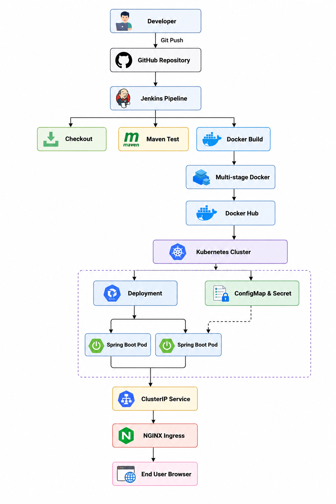
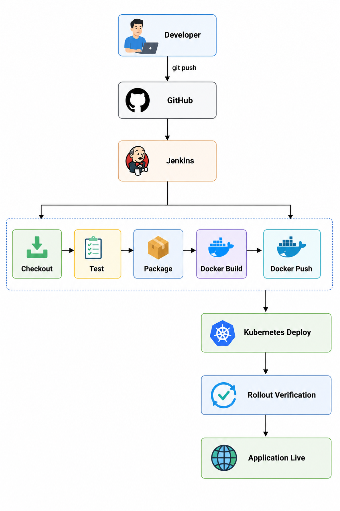
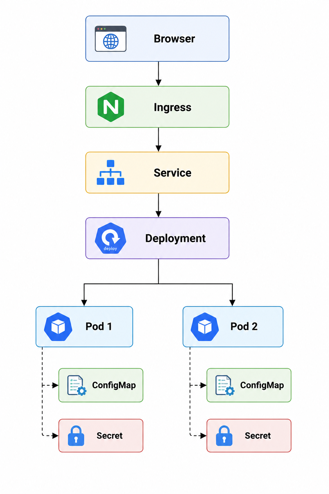
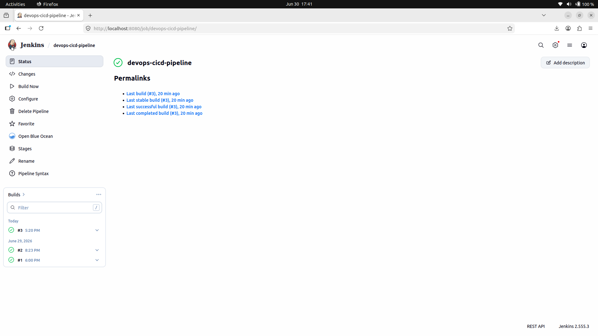
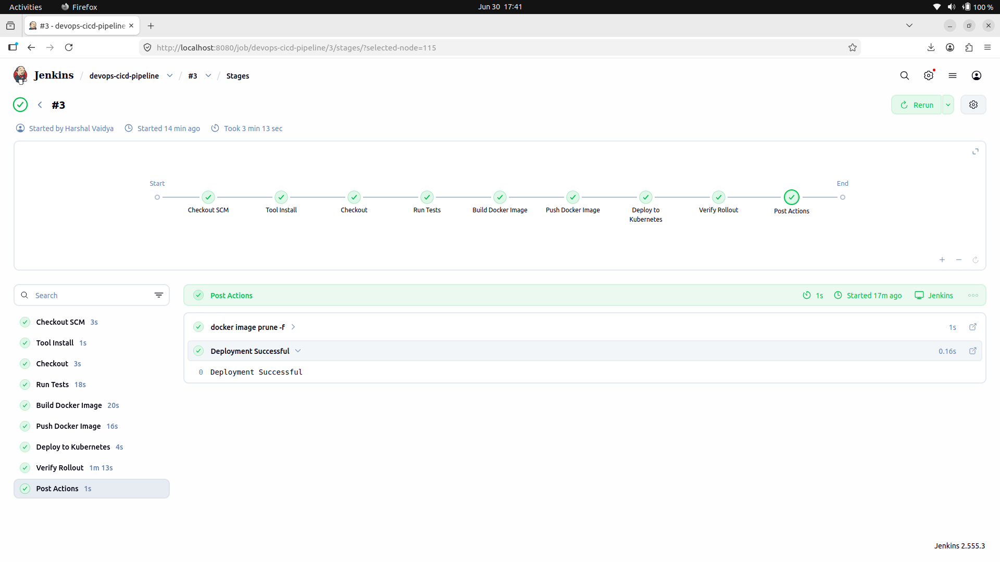
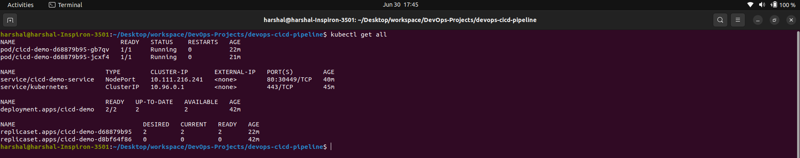
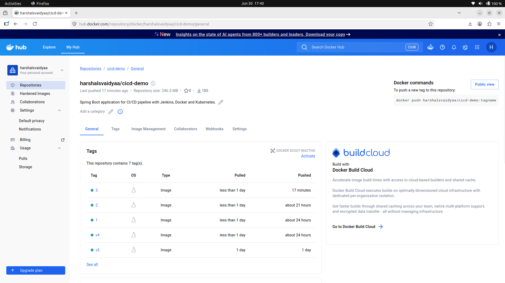
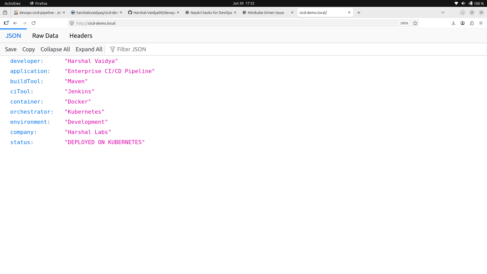

# 🚀 Enterprise CI/CD Pipeline using Jenkins, Docker & Kubernetes


## 📑 Table of Contents

- [Project Overview](#-project-overview)
- [Architecture](#️-architecture)
- [Technology Stack](#️-technology-stack)
- [CI/CD Pipeline Workflow](#-cicd-pipeline-workflow)
- [Project Structure](#-project-structure)
- [Features](#-features)
- [Pipeline Stages](#-pipeline-stages)
- [Docker](#-docker)
- [Kubernetes Features](#️-kubernetes-features)
- [Screenshots](#-screenshots)
- [Getting Started](#️-getting-started)
- [Future Enhancements](#-future-enhancements)
- [Key DevOps Concepts Demonstrated](#-key-devops-concepts-demonstrated)
- [Author](#-author)
- [License](#-license)

---
## 📌 Project Overview

This project demonstrates a **production-inspired end-to-end CI/CD pipeline** that automates the build, test, containerization, and deployment of a Spring Boot application using **Jenkins, Docker, Docker Hub, and Kubernetes (Minikube)**.

The pipeline follows modern DevOps practices such as **Infrastructure Automation, Continuous Integration, Continuous Delivery, Containerization, Rolling Updates, Health Monitoring, Configuration Management, and Kubernetes Orchestration**.

---

## 🏗️ Architecture

### Overall Architecture



---

### CI/CD Pipeline



---

### Kubernetes Architecture



---

## 🛠️ Technology Stack

| Category | Technologies |
|----------|--------------|
| Programming Language | Java 17 |
| Framework | Spring Boot |
| Build Tool | Maven |
| Version Control | Git, GitHub |
| CI/CD | Jenkins |
| Containerization | Docker |
| Container Registry | Docker Hub |
| Orchestration | Kubernetes (Minikube) |
| Networking | Kubernetes Service, NGINX Ingress |
| Configuration | ConfigMap, Secret |
| Monitoring | Spring Boot Actuator |
| Operating System | Ubuntu 22.04 LTS |

---
## 🔄 CI/CD Pipeline Workflow

```
GitHub
   │
   ▼
Jenkins
   │
   ├── Checkout Source Code
   ├── Execute Unit Tests
   ├── Build Docker Image
   ├── Push Image to Docker Hub
   ├── Deploy to Kubernetes
   └── Verify Rollout Status
         │
         ▼
 Kubernetes Deployment Updated
```

---

## 📂 Project Structure

```
devops-cicd-pipeline/
│
├── app/
│   └── cicd-demo/
│       ├── src/
│       ├── Dockerfile
│       ├── pom.xml
│       └── mvnw
│
├── kubernetes/
│   ├── deployment.yaml
│   ├── service.yaml
│   ├── ingress.yaml
│   ├── configmap.yaml
│   └── secret.yaml
│
├── Jenkinsfile
├── diagrams/
├── screenshots/
├── docs/
├── LICENSE
└── README.md
```

---
## ✨ Features

- ✅ End-to-End CI/CD Pipeline
- ✅ Jenkins Declarative Pipeline
- ✅ Automated Docker Image Build
- ✅ Docker Hub Integration
- ✅ Kubernetes Deployment
- ✅ NGINX Ingress
- ✅ ConfigMaps
- ✅ Secrets
- ✅ Rolling Updates
- ✅ Liveness Probe
- ✅ Readiness Probe
- ✅ Resource Requests & Limits
- ✅ Spring Boot Health Endpoints
- ✅ Multi-stage Docker Build
- ✅ Optimized Docker Image
- ✅ Production-inspired Project Structure

---

## 🚀 Pipeline Stages

The Jenkins pipeline performs the following tasks:

1. Checkout source code from GitHub
2. Execute Maven tests
3. Build Docker image using Multi-stage Dockerfile
4. Push Docker image to Docker Hub
5. Update Kubernetes Deployment
6. Verify Rolling Update
7. Confirm successful deployment

---

## 🐳 Docker

Implemented **Multi-stage Docker Build** for:

- Reduced Image Size
- Faster Deployment
- Better Security
- Clean Runtime Environment

---

## ☸️ Kubernetes Features

The application is deployed using Kubernetes with:

- Deployment
- Service
- Ingress
- ConfigMap
- Secret
- Liveness Probe
- Readiness Probe
- Resource Limits
- Rolling Updates

---

## 📸 Screenshots

### Jenkins Pipeline




---

### Kubernetes Pods



---

### Docker Hub



---

### Application



---

## ▶️ Getting Started

### Clone Repository

```bash
git clone https://github.com/Harshal-Vaidya09/devops-cicd-pipeline.git

cd devops-cicd-pipeline
```

---

### Build Application

```bash
cd app/cicd-demo

./mvnw clean package
```

---

### Build Docker Image

```bash
docker build -t harshalsvaidyaa/cicd-demo:latest .
```

---

### Run Docker Container

```bash
docker run -d \
-p 8080:8080 \
--name cicd-demo \
harshalsvaidyaa/cicd-demo:latest
```

---

### Deploy to Kubernetes

```bash
kubectl apply -f kubernetes/
```

---

### Verify Deployment

```bash
kubectl get pods

kubectl get svc

kubectl get ingress
```

---

## 📈 Future Enhancements

- 🔒 Trivy Security Scanning
- 📊 Prometheus Monitoring
- 📈 Grafana Dashboard
- ☁️ AWS Deployment (EC2 / EKS)
- 🏗️ Terraform Infrastructure as Code
- 🔍 SonarQube Code Analysis
- 🚀 GitHub Actions Pipeline
- 🔄 ArgoCD GitOps Deployment

---

## 📚 Key DevOps Concepts Demonstrated

- Continuous Integration
- Continuous Delivery
- Infrastructure as Code Concepts
- Containerization
- Kubernetes Orchestration
- Configuration Management
- Secrets Management
- Health Monitoring
- Rolling Deployment Strategy
- Image Optimization
- CI/CD Automation

---

## 👨‍💻 Author

**Harshal Vaidya**

Software Test Engineer transitioning into DevOps Engineer.

**GitHub**

https://github.com/Harshal-Vaidya09

---

## ⭐ If you found this project useful

Please consider giving it a ⭐ on GitHub!

It helps others discover the project and motivates further improvements.

---

### 📄 License

This project is licensed under the **MIT License**.